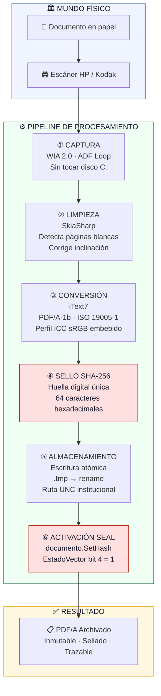
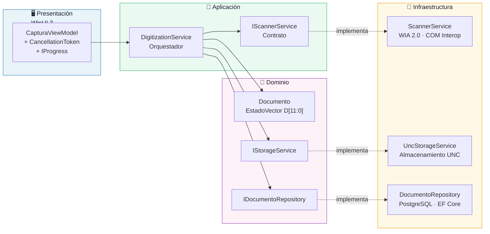
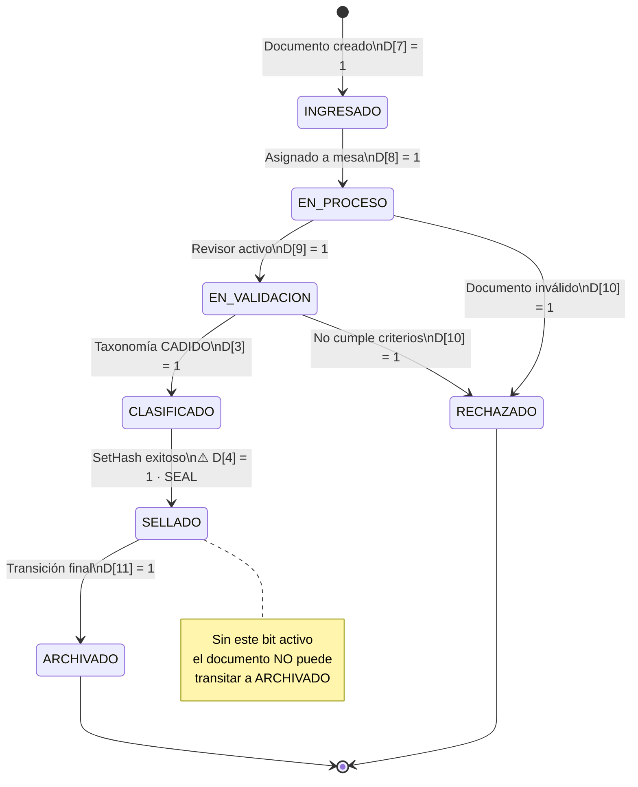
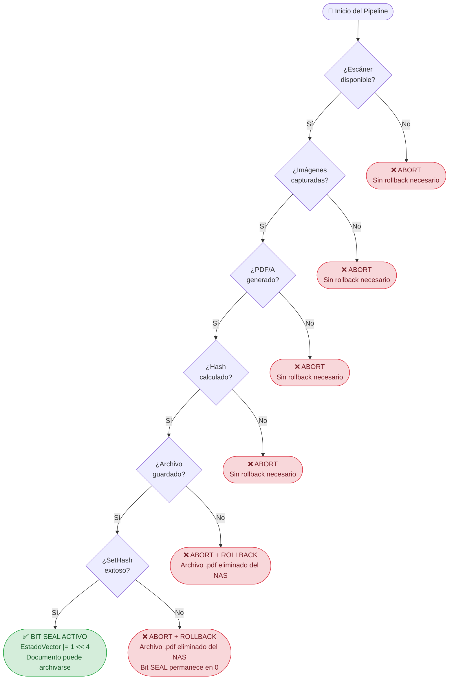
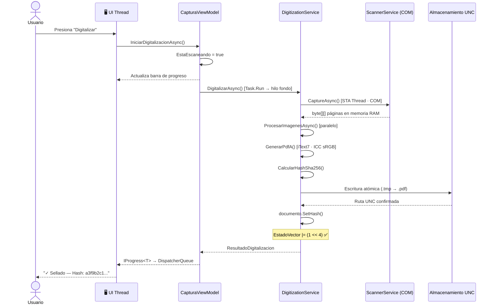
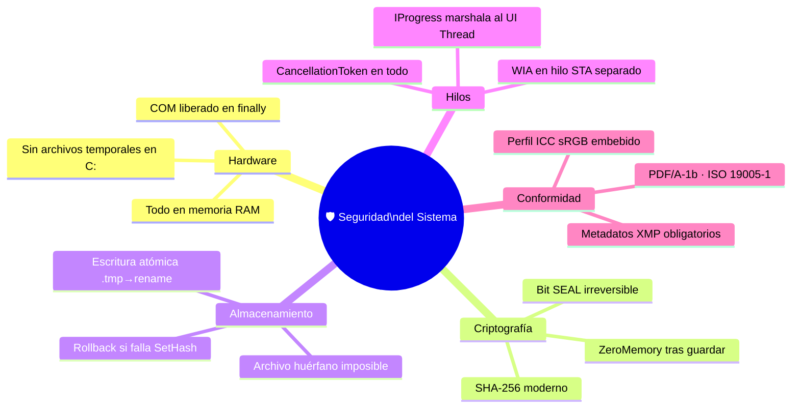
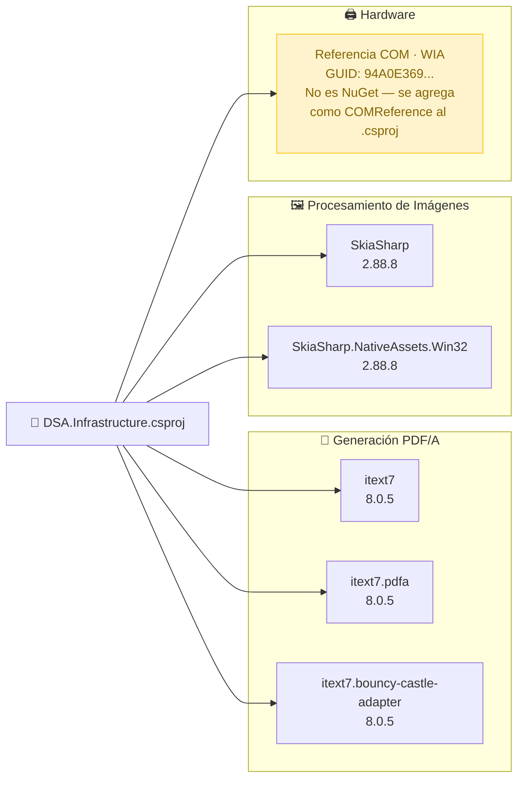
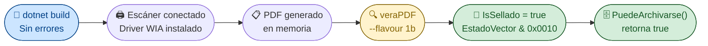

# 📦 DSA — Sistema de Digitalización Archivística

> Módulo de captura, procesamiento y sellado criptográfico de documentos físicos.
> De papel a archivo digital blindado, en un solo flujo automatizado.

---

## 🗺️ Vista General del Sistema



---

## 🏗️ Arquitectura por Capas



---

## ⚡ Máquina de Estados del Documento



---

## 🔐 El Bit SEAL — Regla de Negocio Central



---

## 🧵 Modelo de Hilos (WinUI 3)



---

## 📂 Estructura de Archivos en el Proyecto

```mermaid
graph TD
    ROOT["📁 DSA (Solución)"]

    ROOT --> DOM["📁 DSA.Domain"]
    ROOT --> APP["📁 DSA.Application"]
    ROOT --> INFRA["📁 DSA.Infrastructure"]
    ROOT --> PRES["📁 DSA.Presentation"]

    DOM --> D1["📄 Entities/Documento.cs\nEstadoVector D[11:0]\n+ Audit Trail"]
    DOM --> D2["📄 Interfaces/IDocumentoRepository.cs"]
    DOM --> D3["📄 Interfaces/IStorageService.cs\n+ EliminarSiExisteAsync ← NUEVO"]
    DOM --> D4["📄 Exceptions/DocumentoInvalidoException.cs\n← NUEVO"]

    APP --> A1["📄 Interfaces/IScannerService.cs\n← REEMPLAZAR"]
    APP --> A2["📄 DTOs/ScannerDTOs.cs\n← NUEVO"]
    APP --> A3["📄 DTOs/DigitizationDTOs.cs\n← NUEVO"]
    APP --> A4["📄 Services/DigitizationService.cs\n← REEMPLAZAR"]

    INFRA --> I1["📄 Hardware/ScannerService.cs\n← REEMPLAZAR"]
    INFRA --> I2["📄 Storage/UncStorageService.cs\n+ Escritura atómica ← MODIFICAR"]
    INFRA --> I3["📁 Resources/sRGB_v4_ICC_preference.icc\n← DESCARGAR"]

    PRES --> P1["📄 ViewModels/CapturaViewModel.cs\n+ CancellationToken ← MODIFICAR"]
    PRES --> P2["📄 Extensions/DispatcherQueueExtensions.cs\n← NUEVO"]
    PRES --> P3["📄 App.xaml.cs\n+ Scoped DigitizationService ← MODIFICAR"]

    style D4 fill:#fff3cd,stroke:#ffc107,color:#856404
    style A1 fill:#cce5ff,stroke:#004085,color:#004085
    style A2 fill:#fff3cd,stroke:#ffc107,color:#856404
    style A3 fill:#fff3cd,stroke:#ffc107,color:#856404
    style A4 fill:#cce5ff,stroke:#004085,color:#004085
    style I1 fill:#cce5ff,stroke:#004085,color:#004085
    style I2 fill:#d4edda,stroke:#155724,color:#155724
    style I3 fill:#f8d7da,stroke:#721c24,color:#721c24
    style P1 fill:#d4edda,stroke:#155724,color:#155724
    style P2 fill:#fff3cd,stroke:#ffc107,color:#856404
    style P3 fill:#d4edda,stroke:#155724,color:#155724
    style D3 fill:#d4edda,stroke:#155724,color:#155724
```



#### Leyenda

| Color | Significado |
|---|---|
| 🔵 Azul | Archivo a **reemplazar** completamente |
| 🟡 Amarillo | Archivo **nuevo** que hay que crear |
| 🟢 Verde | Archivo existente a **modificar** (agregar líneas) |
| 🔴 Rojo | Recurso externo a **descargar** |

---

## 📋 Lista de Tareas de Integración

```mermaid
gantt
    title Orden de Integración Recomendado
    dateFormat  X
    axisFormat  Paso %s

    section Preparación
    Instalar paquetes NuGet en DSA.Infrastructure.csproj     :done, p1, 0, 1
    Agregar referencia COM WIA al .csproj                    :done, p2, 1, 2
    Descargar perfil ICC sRGB a Resources/                   :crit, p3, 2, 3

    section Dominio
    Agregar EliminarSiExisteAsync a IStorageService.cs       :p4, 3, 4
    Implementarlo en UncStorageService.cs                    :p5, 4, 5
    Agregar Audit Trail a Documento.cs                       :p6, 5, 6
    Crear DocumentoInvalidoException.cs                      :p7, 6, 7

    section Interfaces y DTOs
    Crear ScannerDTOs.cs                                     :p8, 7, 8
    Reemplazar IScannerService.cs                            :p9, 8, 9
    Crear DigitizationDTOs.cs                                :p10, 9, 10

    section Servicios
    Reemplazar ScannerService.cs                             :p11, 10, 11
    Reemplazar DigitizationService.cs                        :p12, 11, 12

    section Presentación
    Modificar CapturaViewModel.cs                            :p13, 12, 13
    Crear DispatcherQueueExtensions.cs                       :p14, 13, 14
    Modificar App.xaml.cs (Scoped)                           :p15, 14, 15
```



---

## 🔒 Garantías de Seguridad



---

## 📦 Paquetes Requeridos



### Comandos de instalación

```bash
cd DSA.Infrastructure

dotnet add package itext7 --version 8.0.5
dotnet add package itext7.pdfa --version 8.0.5
dotnet add package itext7.bouncy-castle-adapter --version 8.0.5
dotnet add package SkiaSharp --version 2.88.8
dotnet add package SkiaSharp.NativeAssets.Win32 --version 2.88.8
```

---

## ✅ Validación Final



> **Descarga del validador PDF/A:** <https://verapdf.org>
>
> **Descarga del perfil ICC sRGB:** <https://www.color.org/srgbprofiles.xalter>
